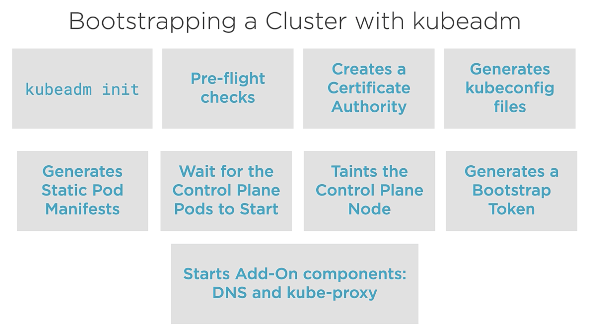
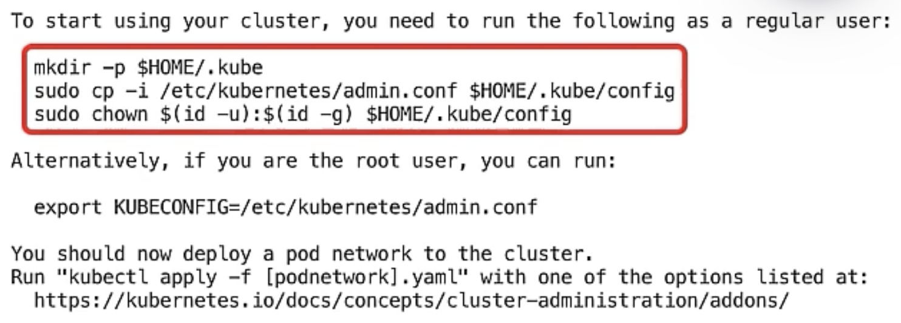

# K8S Administration v1.29

## Baseline set up
**For each nodes do :**

### Hostname

Set hostname of the different server parts constituting a cluster.
```
sudo hostnamectl set-hostname <your server identifier name >
```
Configure mapping to simplify communications between servers
```
sudo vim /etc/hosts
```
All entries need to be correctly mapped and copy on each part of the cluster

### Kernel configuration
Configure Linux kernel modules required to run containerd, a platform used to manage containers. These modules (overlay and br_netfilter) are essential for containerd (and Docker, if used) to function properly. They allow to efficiently manage the containers' file systems and configure the networks needed for their communication.
```
cat << EOF | sudo tee /etc/modules-load.d/containerd.conf
overlay
br_netfilter
EOF
```
Load Linux kernel modules into the system
```
sudo modprobe overlay
sudo modprobe br_netfilter
```
**OverlayFS** is a stacked file system that allows multiple file systems to be layered on top of each other. It is particularly used in containers (like Docker and containerd) to efficiently manage image layers.

**br_netfilter** module is crucial in container environments that use network bridges, such as Kubernetes or Docker. It ensures that network packet management tools, such as iptables, can properly handle network traffic between containers or between a container and the outside world.

The following command configures some Linux kernel networking settings required for Kubernetes and its container runtime (CRI)
```
cat << EOF | sudo tee /etc/sysctl.d/99-kubernetes-cri.conf
net.bridge.bridge-nf-call-iptables  = 1
net.bridge.bridge-nf-call-ip6tables = 1
net.ipv4.ip_forward                 = 1
EOF
```
Then apply the system settings defined in the configuration files (located in /etc/sysctl.conf and /etc/sysctl.d/)
```
sudo sysctl --system
```
### containerd setup
Update and install containerd
```
sudo apt-get update && sudo apt-get install -y containerd
```
Then configure containerd, the container runtime, by generating a default configuration file and registering it in the system. Finally restart the service.
```
sudo mkdir -p /etc/containerd
sudo containerd config default | sudo tee /etc/containerd/config.toml
```
Set the cgroup driver for containerd to systemd which is required for kubelet
```
sudo sed -i 's/            SystemdCgroup = false/            SystemdCgroup = true/' /etc/containerd/config.toml            
```
Verify 
```
sudo grep 'SystemdCgroup = true' /etc/containerd/config.toml
```
Restart containerd with the new configuration
```
sudo systemctl restart containerd
```
Kubernetes requires swap to be disabled on cluster nodes because the container management system expects to manage memory directly without swap intervention.  
```
sudo swapoff -a
```
*The command disables swap until the next reboot. If you reboot, the swap spaces defined in /etc/fstab will be re-enabled automatically.*
```
sudo vi /etc/fstab
```

### Installation of kubelet, kubeadm and kubectl
Install libs to download and manage files via secure protocols (HTTPS)
```
sudo apt-get update && sudo apt-get install -y apt-transport-https ca-certificates curl gpg
```
Add k8s.io's apt repository gpg key, warn for k8s version
```
sudo curl -fsSL https://pkgs.k8s.io/core:/stable:/v1.29/deb/Release.key | sudo gpg --dearmor -o /etc/apt/keyrings/kubernetes-apt-keyring.gpg
```
Add the kubernetes apt repository
```
echo 'deb [signed-by=/etc/apt/keyrings/kubernetes-apt-keyring.gpg] https://pkgs.k8s.io/core:/stable:/v1.29/deb/ /' | sudo tee /etc/apt/sources.list.d/kubernetes.list
```
Update the package list and inspect available versions with apt-cache
```
sudo apt-get update
sudo apt-cache policy kubelet | head -n 20
```

Then install specific version of kubelet, kubeadm, kubectl
```
VERSION=1.29.1-1-1
sudo apt-get install -y kubelet=$VERSION kubeadm=$VERSION kubectl=$VERSION
```
The following command prevents APT from automatically updating the specified packages (in this case, kubelet, kubeadm, and kubectl):
```
sudo apt-mark hold kubelet kubeadm kubectl containerd
```

Verify systemd Units  
Note that kubelet is in dead status until a cluster is created or a node is joined to an existing cluster
```
sudo systemctl status kubelet.service
sudo systemctl status containerd.service
```

End of the baseline setup for each node of K8S cluster

## Control plane


Go on the control plane node.  
First we download calico manifest and check the network pod range (CALICO_IPV4POOL_CIDR)
```
wget https://raw.githubusercontent.com/projectcalico/calico/master/manifests/calico.yaml
vi calico.yaml
```
Bootstrap the cluster
```
sudo kubeadm init --kubernetes-version 1.29.1
```


Copy and past :
```
mkdir -p $HOME/.kube
sudo cp -i /etc/kubernetes/admin.conf $HOME/.kube/config
sudo chown $(id -u):$(id -g) $HOME/.kube/config
```

Start calico pod, the pod network 
```
kubectl apply -f calico.yaml
```
See all the pods status 
```
kubectl get pods --all-namespaces --watch
```
To see nodes status
```
kubectl get nodes
```
Check kubelet service status
```
sudo systemctl status kubelet.service
```

Check out the static pods manifests
```
ls /etc/kubernetes/manifests
sudo more /etc/kubernetes/manifests/etcd.yaml
sudo more /etc/kubernetes/manifests/kube-apiserver.yaml
```
Check out the conf of static pods on /etc/kubernetes
## Worker nodes
Now to join the other nodes (workers) to the cluster go to the control plane node :
```
sudo kubeadm token create --print-join-command
```

Then copy the output command and paste it on the others worker nodes

Finally test the installation on control plane by running :
See all the pods status 
```
kubectl get pods --all-namespaces --watch
```
To see nodes status
```
kubectl get nodes
```

## Troobleshoots

### Verify containerd services
Verify that containerd.sock has been created
```bash
ubuntu@wk-node01:~$ ls -l /run/containerd/containerd.sock
srw-rw---- 1 root root 0 Nov 27 12:24 /run/containerd/containerd.sock
```
If not restart service to see if a warning is mentionned and perform the operation then restart the service
```bash
ubuntu@wk-node01:~$ sudo systemctl restart containerd.service 
Warning: The unit file, source configuration file or drop-ins of containerd.service changed on disk. Run 'systemctl daemon-reload' to reload units.
```
Verify the file presence.

### Verify cri configuration
If you meet :
```
sudo crictl --runtime-endpoint unix:///run/containerd/containerd.sock ps
FATA[0000] validate service connection: validate CRI v1 runtime API for endpoint "unix:///run/containerd/containerd.sock": rpc error: code = Unavailable desc = connection error: desc = "transport: Error while dialing: dial unix /run/containerd/containerd.socks: connect: no such file or directory" 
```
Verify the presence of cri.yaml
```
whereis crictl.yaml
```
else create and configure it to use containerd.sock
```bash
sudo tee /etc/crictl.yaml > /dev/null <<EOF
runtime-endpoint: unix:///run/containerd/containerd.sock
image-endpoint: unix:///run/containerd/containerd.sock
timeout: 10
debug: false
EOF
```
I should work for both commands : 
```bash
sudo crictl --runtime-endpoint unix:///run/containerd/containerd.sock ps
sudo crictl ps
```
## I can't delete pods - still terminating status
### containerd.sock
If after a describe you see a permission issues, it may be due to a misconfiguration often related to the runtime endpoint.
Verify that unix:///run/containerd/containerd.sock is used by kubectl to communicate with containerd.

```bash 
sudo vi /var/lib/kubelet/config.yaml
# Configure this entry if empty
containerRuntimeEndpoint: unix:///run/containerd/containerd.sock
# Save and restart kubelet service
```
Check on all nodes of the cluster  
Test kubectl delete  
Check the installation process to avoid this issue for future deployment 

### Apparmor
If it still doesn't work it maybe due to apparmor that prevent you to use runc, to verify this point:
```bash
sudo dmesg | grep runc
```
If you see issues with usage of runc related to apparmor, you are on the path of resolution.  
Check if you see restriction on runc : 
```
sudo apparmor_status
```
Explore the profile on ```/etc/apparmor.d```, you may see a profile related to runc, disable this profile :
(aa-disable is provided with sudo ```apt-get install apparmor-utils```)
```
sudo aa-disable /etc/apparmor.d/runc
sudo systemctl restart apparmor

```
Perform this on each node, finally it solves the problem.
But this point need to be configured on the installation path.
Check the presence of symbolic link in : 
```bash
ll /etc/apparmor.d/disable
```
else persist the config but it is the purpose of using aa-disable
```bash
sudo ln -s /etc/apparmor.d/runc /etc/apparmor.d/disable/
```
You can also refer to apparmor to configure properly in a file each profile ...