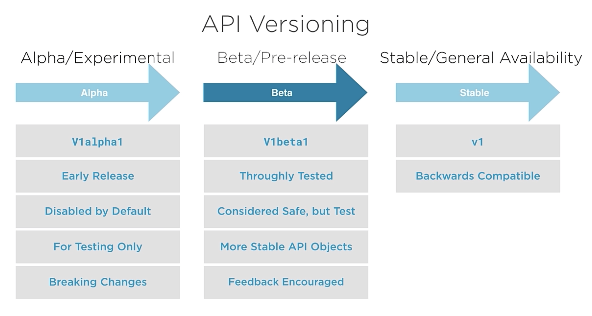
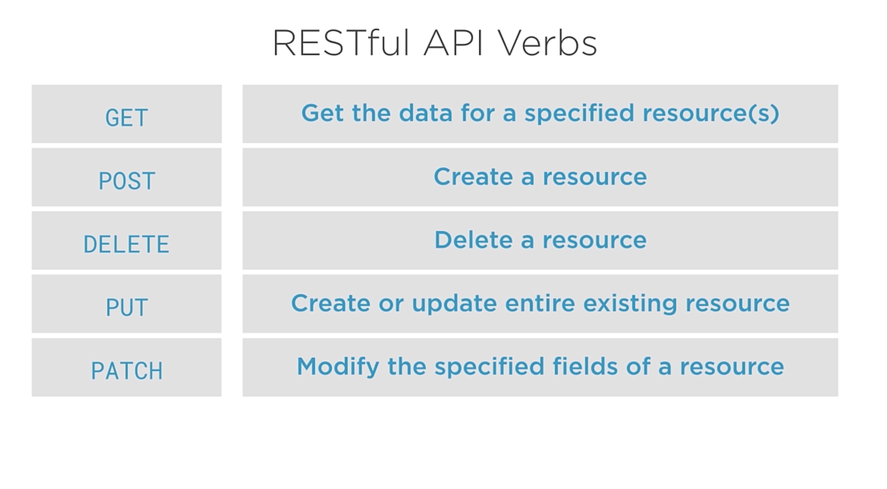

# K8S api
https://kubernetes.io/docs/reference/kubernetes-api/

## --dry-run 
### Summary of Differences

| Aspect                   | `--dry-run=client`             | `--dry-run=server`               |
|--------------------------|--------------------------------|----------------------------------|
| Validation Location      | Local (client machine)        | Kubernetes server (cluster)     |
| Cluster Connection       | No                           | Yes                             |
| Dependency Validation    | No                           | Yes                             |
| Policy Enforcement Check | No                           | Yes                             |

### General Guidelines:
- Use `--dry-run=client` to validate a file when you do not have access to a cluster.
- Use `--dry-run=server` for comprehensive validation in the context of the cluster.

### kubectl diff
A usefull command to compare diff between a resource running on the k8s cluster and the compare manifest.

## API discovery
Verify all the clusters you can reach
```
kubectl config get-contexts
```
Change context if needed to operate the targeted cluster
```bash
kubectl config use-context <NAME>
```
Usefull commands
```bash
kubectl cluster-info 
kubectl api-resources | more
kubectl explain <resource> | more # act like a resource command documentation
```
## Kubernetes API Groups

API Groups organize Kubernetes APIs, making them modular and extensible.

### Types of API Groups
1. **Core Group**: No group name; includes resources like Pods, Nodes, Services.
2. **Named Groups**:
   - `apps`: Manages workloads (e.g., Deployments, StatefulSets).
   - `batch`: Handles batch jobs (e.g., Jobs, CronJobs).
   - `networking.k8s.io`: Manages Network Policies.
   - `rbac.authorization.k8s.io`: Handles Role-Based Access Control (RBAC).
   - Custom groups for custom resources via CRDs.

### Benefits
- **Versioning**: Supports multiple API versions (`v1`, `v1beta1`).
- **Extensibility**: Enables new features without breaking existing APIs.

### Examples
API paths vary based on the group:
- Core group: `/api/v1/pods`
- Named group: `/apis/apps/v1/deployments`

### Search in a specific group
```bash
ubuntu@cp-node01:~$ kubectl api-resources --api-group=apps
NAME                  SHORTNAMES   APIVERSION   NAMESPACED   KIND
controllerrevisions                apps/v1      true         ControllerRevision
daemonsets            ds           apps/v1      true         DaemonSet
deployments           deploy       apps/v1      true         Deployment
replicasets           rs           apps/v1      true         ReplicaSet
statefulsets          sts          apps/v1      true         StatefulSet
```
```bash
kubectl explain deployment --api-version=apps/v1
```
```bash
ubuntu@cp-node01:~$ kubectl api-versions | sort |more
admissionregistration.k8s.io/v1
apiextensions.k8s.io/v1
apiregistration.k8s.io/v1
apps/v1
authentication.k8s.io/v1
authorization.k8s.io/v1
autoscaling/v1
autoscaling/v2
batch/v1
certificates.k8s.io/v1
coordination.k8s.io/v1
crd.projectcalico.org/v1
discovery.k8s.io/v1
events.k8s.io/v1
flowcontrol.apiserver.k8s.io/v1
flowcontrol.apiserver.k8s.io/v1beta3
networking.k8s.io/v1
node.k8s.io/v1
policy.networking.k8s.io/v1alpha1
policy/v1
rbac.authorization.k8s.io/v1
scheduling.k8s.io/v1
storage.k8s.io/v1
v1
```
## API Versionning rules

## RESTful Verbs

## Verbosity Levels for `kubectl -v`

| **Level (`-v`)** | **Description**                                                                                          |
|-------------------|--------------------------------------------------------------------------------------------------------|
| **0**            | Default behavior. Displays only essential output without extra details.                                |
| **1**            | Adds basic information about the internal processing of the command.                                   |
| **2**            | Includes additional details about HTTP requests sent to the API server.                                |
| **3**            | Displays HTTP headers for requests sent to the API server.                                             |
| **4**            | Adds HTTP headers for responses received from the API server.                                          |
| **5**            | Includes detailed information about HTTP requests and responses, including payload content.            |
| **6**            | Shows debugging information about internal steps and interactions, including transformations.          |
| **7**            | Includes sensitive data like authentication tokens and certificates (use with caution).                |
| **8**            | Adds gRPC call details if applicable, along with higher verbosity for internal operations.             |
| **9**            | Maximum verbosity. Outputs all available debug information, including raw gRPC streams where relevant. |

### Use Cases:
- **Low verbosity** (`-v 0-2`): Ideal for regular use and troubleshooting basic issues.
- **Moderate verbosity** (`-v 3-5`): Useful for debugging API interactions.
- **High verbosity** (`-v 6-9`): Helps in deep debugging and analyzing issues within Kubernetes or `kubectl`.

### Troubleshooting in details
```
kubectl proxy &
curl 127.0.0.1:8001/api/v1/namespaces/default/pods | jq
```
Stop proxy
```
ubuntu@cp-node01:~$ fg
kubectl proxy
^C
```


