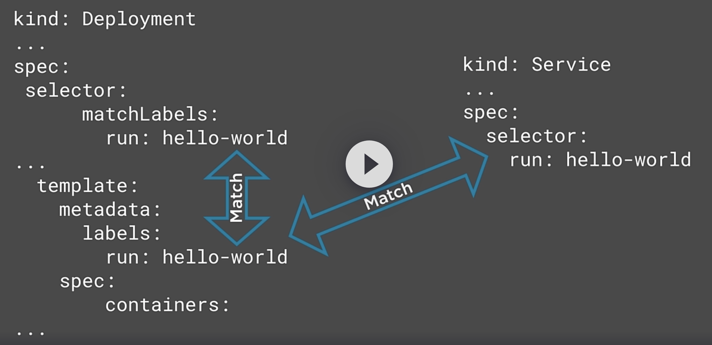

# Labels, annotations and namespaces
## Namespaces
### Why ?
- Subdivide a cluster and its resources
- A virtual cluster
- Resource isolation (multitenants, organisation, environments, technical resources, security, ...)
Warn : physical things are not namespaced (nodes, PersistentVolumes)
```
ubuntu@cp-node01:~$ kubectl get namespaces 
NAME              STATUS   AGE
default           Active   6d2h
kube-node-lease   Active   6d2h
kube-public       Active   6d2h
kube-system       Active   6d2h
```
### Namespaced resources 
Some API resources can or not be in a namespace, so to know this :
```
ubuntu@cp-node01:~$ kubectl api-resources --namespaced=true | head
NAME                        SHORTNAMES   APIVERSION                     NAMESPACED   KIND
bindings                                 v1                             true         Binding
configmaps                  cm           v1                             true         ConfigMap
endpoints                   ep           v1                             true         Endpoints
events                      ev           v1                             true         Event
limitranges                 limits       v1                             true         LimitRange
persistentvolumeclaims      pvc          v1                             true         PersistentVolumeClaim
pods                        po           v1                             true         Pod
podtemplates                             v1                             true         PodTemplate
replicationcontrollers      rc           v1                             true         ReplicationController
ubuntu@cp-node01:~$ kubectl api-resources --namespaced=false | head
NAME                              SHORTNAMES   APIVERSION                          NAMESPACED   KIND
componentstatuses                 cs           v1                                  false        ComponentStatus
namespaces                        ns           v1                                  false        Namespace
nodes                             no           v1                                  false        Node
persistentvolumes                 pv           v1                                  false        PersistentVolume
mutatingwebhookconfigurations                  admissionregistration.k8s.io/v1     false        MutatingWebhookConfiguration
validatingwebhookconfigurations                admissionregistration.k8s.io/v1     false        ValidatingWebhookConfiguration
customresourcedefinitions         crd,crds     apiextensions.k8s.io/v1             false        CustomResourceDefinition
apiservices                                    apiregistration.k8s.io/v1           false        APIService
selfsubjectreviews                             authentication.k8s.io/v1            false        SelfSubjectReview
```
Describe namespace or a specific one to see details
```
kubectl describe namespaces kube-public
```
### Play with namespace
```
kubectl create namespace staging --dry-run=server --output yaml >> staging-namespace.yaml
kubectl apply -f staging-namespace.yaml 
kubectl get namespaces
kubectl create deployment hello-world --namespace staging --image=gcr.io/google-samples/hello-app:1.0
kubectl scale deployment hello-world --replicas=3 --namespace staging
kubectl expose deployment hello-world --port 80 --target-port 8080 --namespace staging
kubectl get all --namespace staging 
```
And delete all in one shot
```
kubectl delete namespaces staging 
```
## Labels
### Why ?
- Organize resources
- Label selectors to select/query objects
- Return objects that satisfy search conditions
- Perform operations on a collection of resources
- Influence internal K8S operations

We can have more than one label per resource (K = 63 bytes, V = 253 bytes)

Kubernetes uses labels to manage resources :
- Controllers and services match pods using selector]
- Influencing Pod scheduling
  - Scheduling to specific nodes
  - Special hardware (SSD or GPU)
  - Using a label selector



### Labels in action
Here is a manifest used as a test for label usage : 
```yaml
apiVersion: v1
kind: Pod
metadata:
  name: nginx-pod-01
  labels:
    app: MyWebApp
    version: v1
    environment: prod
spec:
  containers:
  - name: nginx
    image: nginx
    ports:
    - containerPort: 80
---
apiVersion: v1
kind: Pod
metadata:
  name: nginx-pod-02
  labels:
    app: MyWebApp
    version: v1.1
    environment: prod
spec:
  containers:
  - name: nginx
    image: nginx
    ports:
    - containerPort: 80
---
apiVersion: v1
kind: Pod
metadata:
  name: nginx-pod-03
  labels:
    app: MyWebApp
    version: v1.1
    environment: qa
spec:
  containers:
  - name: nginx
    image: nginx
    ports:
    - containerPort: 80
---
apiVersion: v1
kind: Pod
metadata:
  name: nginx-pod-04
  labels:
    app: MyAdminApp
    version: v1
    environment: prod
spec:
  containers:
  - name: nginx
    image: nginx
    ports:
    - containerPort: 80
```
Then
```
kubectl apply -f <the yaml file>
kubectl get pods --show-labels
```
```
ubuntu@cp-node01:~$ kubectl describe pod nginx-pod-01 | head
Name:             nginx-pod-01
Namespace:        default
Priority:         0
Service Account:  default
Node:             wk-node02/10.0.0.11
Start Time:       Thu, 28 Nov 2024 06:53:38 +0000
Labels:           app=MyWebApp
                  environment=prod
                  version=v1
Annotations:      cni.projectcalico.org/containerID: 739d4ce5708c2afcf50223ab4459f3962f326dc71202a087f28a0e60df6071ea
```
Filtering resources with --selector or -l
```bash
ubuntu@cp-node01:~$ kubectl get pods --selector environment=qa
NAME           READY   STATUS    RESTARTS   AGE
nginx-pod-03   1/1     Running   0          8m51s
ubuntu@cp-node01:~$ kubectl get pods -l environment=prod
NAME           READY   STATUS    RESTARTS   AGE
nginx-pod-01   1/1     Running   0          13m
nginx-pod-02   1/1     Running   0          8m57s
nginx-pod-04   1/1     Running   0          8m57s
```
```
ubuntu@cp-node01:~$ kubectl get pods --show-labels 
NAME           READY   STATUS    RESTARTS   AGE   LABELS
nginx-pod-01   1/1     Running   0          19m   app=MyWebApp,environment=prod,version=v1
nginx-pod-02   1/1     Running   0          15m   app=MyWebApp,environment=prod,version=v1.1
nginx-pod-03   1/1     Running   0          15m   app=MyWebApp,environment=qa,version=v1.1
nginx-pod-04   1/1     Running   0          15m   app=MyAdminApp,environment=prod,version=v1
ubuntu@cp-node01:~$ kubectl get pods --selector 'app=MyWebApp,environment=prod'
NAME           READY   STATUS    RESTARTS   AGE
nginx-pod-01   1/1     Running   0          20m
nginx-pod-02   1/1     Running   0          16m
ubuntu@cp-node01:~$ kubectl get pods --selector 'app=MyWebApp,environment!=prod'
NAME           READY   STATUS    RESTARTS   AGE
nginx-pod-03   1/1     Running   0          17m
ubuntu@cp-node01:~$ kubectl get pods --selector 'environment in (prod,qa)'
NAME           READY   STATUS    RESTARTS   AGE
nginx-pod-01   1/1     Running   0          26m
nginx-pod-02   1/1     Running   0          22m
nginx-pod-03   1/1     Running   0          22m
nginx-pod-04   1/1     Running   0          22m
ubuntu@cp-node01:~$ kubectl get pods --selector 'environment notin (prod,qa)'
No resources found in default namespace.
```
Output a specific column related to one or more label keys
```
ubuntu@cp-node01:~$ kubectl get pods -L environment
NAME           READY   STATUS    RESTARTS   AGE   ENVIRONMENT
nginx-pod-01   1/1     Running   0          29m   prod
nginx-pod-02   1/1     Running   0          25m   prod
nginx-pod-03   1/1     Running   0          25m   qa
nginx-pod-04   1/1     Running   0          25m   prod
```
Edit a label
```
kubectl label pod nginx-pod-01 environment=staging --overwrite
```
Add a label
```
kubectl label pod nginx-pod-01 version-name=Jupiter
kubectl get pods -L environment,version-name
```
Removing a label
```
kubectl label pod nginx-pod-01 version-name-
```
Add a label to all pods
```
kubectl label pod --all version-name=Jupiter
```
Delete pods based on a label
```
kubectl delete pods --selector version-name=Jupiter
```
## Labels and replicas
Here is the manifest to test the case
```yaml
apiVersion: apps/v1
kind: Deployment
metadata:
  name: hello-world
  labels:
    app: hello-world
spec:
  replicas: 4
  selector:
    matchLabels: 
      app: hello-world
  template:
    metadata:
      labels:
        app: hello-world
    spec:    
      containers:
        - name: hello-world
          image: gcr.io/google-samples/hello-app:1.0
          ports:
            - containerPort: 8080
```
Expose a service for this deployment
```yaml
apiVersion: v1
kind: Service
metadata:
  name: hello-world
spec:
  ports:
  - port: 80
    protocol: TCP
    targetPort: 8080
  selector:
    app hello-world
```
Observe how labels and selectors are used. 
Take a look on pods labels
```
kubectl get pods --show-label
```
Change label "pod-template-hash" of the first pod
```
kubectl label pod hello-world-789db8d56-css7c pod-template-hash=DEBUG --overwrite 
```
As replicaset doesn't find it, it creates another on.  
Explore service and endpoints to fix to four endpoints instead of 5.
```
kubectl describe service hello-world 
kubectl describe endpoints hello-world 
kubectl label pod hello-world-789db8d56-css7c app=DEBUG --overwrite #Remove this pod from label app=hello-world
kubectl describe endpoints hello-world 
```
## Scheduling a pod to a node with nodeSelector
```
kubectl get nodes --show-labels 
```
Assign specific label to nodes
```
kubectl label node wk-node01 disk=local_ssd
kubectl label node wk-node02 hardware=local_gpu
kubectl get nodes -L disk,hardware
```
Let's create 3 pods, and influence scheduler to deploy them on specific nodes.
```yaml
apiVersion: v1
kind: Pod
metadata:
  name: nginx-pod-ssd
spec:
  containers:
  - name: nginx
    image: nginx
    ports:
    - containerPort: 80
  nodeSelector: 
    disk: local_ssd
---
apiVersion: v1
kind: Pod
metadata:
  name: nginx-pod-gpu
spec:
  containers:
  - name: nginx
    image: nginx
    ports:
    - containerPort: 80
  nodeSelector: 
    hardware: local_gpu
---
apiVersion: v1
kind: Pod
metadata:
  name: nginx-pod
spec:
  containers:
  - name: nginx
    image: nginx
    ports:
    - containerPort: 80
```
Apply and observe

## Annotations
### Why ?
- Add additional infos on a specific resource
- Used for tooling, decisions, and integrations
It is not queriable
K=63 bytes,V=256 bytes
```
kubectl annotate pod <pod name> owner=raph
```
## Conclusion


