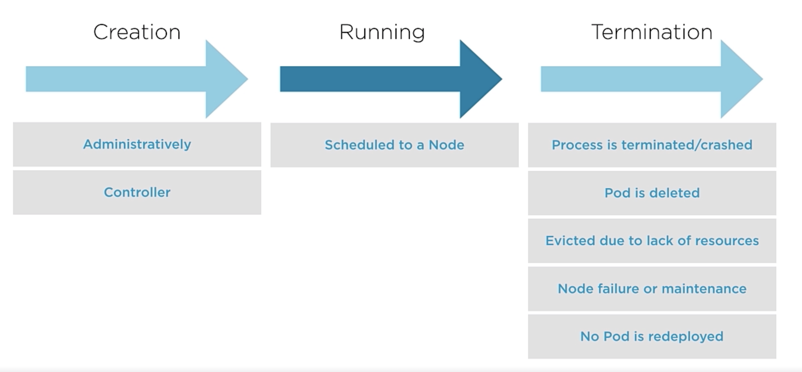
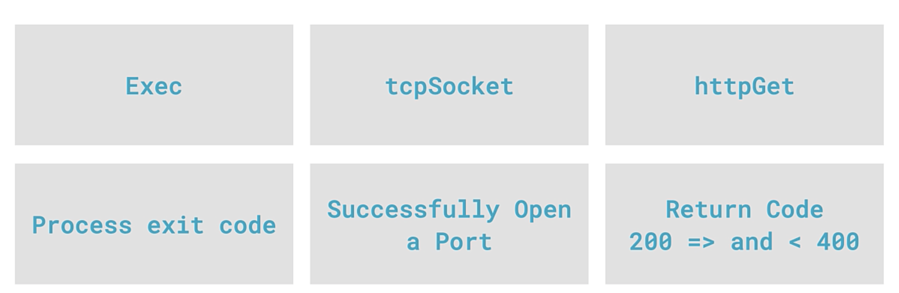

# Pods
## How
Pods is a wrapper around one ore more containers (often 2 for a producer/consumer relationship).
## Controller
Except for bare-pods or naked pods, pods are managed by controllers (deployments, replica set, daemon set ...)
## Static Pods
Managed by kubelet on specific nodes. (e.g calico). 
The manifest is saved in a folder in the system and watched by kubelet (staticPodPath) in ```/etc/kubernetes/manifests```. You can setup configuration of the kubelet in ```/var/lib/kubelet/config.yaml```.  
As static pods are not managed by API Server, kubelet creates Mirror Pods for each to be seen by API Server and kubectl.
### Create a manifest
On the control plane, create a manifest for the static pod
```
kubectl run hello-world --image=gcr.io/google-samples/hello-app:2.0 --dry-run=client -o yaml --port=8080
```
We will connect to a worker and paste the yaml in /etc/kubernetes/manifests. It will be automatically created by kubelet on this specific worker node. See in control plan the pod created (with kubectl it is a mirror pod and you can't deleted it).
To delet this pod, delete the manifest !

### Copy/Paste
Find static pod path
```
cat /var/lib/kubelet/config.yaml | grep staticPodPath
```

## Useful operations
```
kubectl get events --watch &
kubectl -v 6 exec -it <pod name> -- /bin/bash
kubectl port-forward hello-world-7879445f4-x8qpj 8080:8080 &
```

## Multi-container pods
- Tightly coupled operations
- Scheduling processing together
- Requirements on the same resource
- Container producer while the other consumes
### Producer/Consumer scenario

Here we produce data on a shared volume to be access by a consumer

```yaml
apiVersion: v1
kind: Pod
metadata:
  name: multicontainer-pod
spec:
  containers:
  - name: producer
    image: ubuntu
    command: ["/bin/bash"]
    args: ["-c","while true; do echo $(hostname) $(date) >> /var/log/index.html; sleep 10; done"]
    volumeMounts:
    - name: webcontent # Use the volume define below
      mountPath: /var/log
  - name: consumer
    image: nginx
    ports:
    - containerPort: 80
    volumeMounts:
    - name: webcontent # Use the volume define below
      mountPath: /usr/share/nginx/html
  volumes:
  - name: webcontent
    emptyDir: {} #Define a volume on the node level to be share by the 2 containers but it will go away as we delete pod
```
Explore the containers with 
```
kubectl exec -it  multicontainer-pod --container consumer -- /bin/bash
```
Then forward from 8080 listen to 80
```
kubectl port-forward multicontainer-pod 8080:80
```
### Init container scenario
- Before running the main app container
- Utilities or setup for the app
- Run to completion
- Multiple containers can be sequenced
- If on init container failed - the pod can't Start - restartPolicy is applied
```yaml
apiVersion: v1
kind: Pod
metadata:
  name: init-pod
spec:
  initContainers:
  - name: init-service
    image: ubuntu
    command: ['/bin/bash', '-c', "echo service initialisation; sleep 2"]
  - name: init-db
    image: ubuntu
    command: ['/bin/bash', '-c', "echo database initialisation; sleep 2"]
  containers:
  - name: application
    image: nginx
```
Follow pod creation and containers
```
kubectl get pods --watch &
```

## Pod lifecycle

```yaml
apiVersion: v1
kind: Pod
metadata:
  name: pod-lifecycle
spec:
  containers:
  - name: nginx
    image: nginx
  restartPolicy: Always
```
List of command to test :
```bash
kubectl get events --watch &
kubectl apply -f pod-lifecycle.yaml
kubectl exec pod-lifecycle -- apt-get update
kubectl exec pod-lifecycle -- apt-get install procps
kubectl exec pod-lifecycle -- ps -aux
# See restart in action 
```
Explore the spec : 
```bash
kubectl explain pods.spec.restartPolicy
VERSION:    v1

FIELD: restartPolicy <string>

DESCRIPTION:
    Restart policy for all containers within the pod. One of Always, OnFailure,
    Never. In some contexts, only a subset of those values may be permitted.
    Default to Always. More info:
    https://kubernetes.io/docs/concepts/workloads/pods/pod-lifecycle/#restart-policy
    
    Possible enum values:
     - `"Always"` # Default one
     - `"Never"`
     - `"OnFailure"` # Note that here if container returns an output code = 0 it won't restart 
```

## Container probes
- livenessProbe
- readinessProbe
- startupProbe

You can use for each one : 
- tcpSocket probe
- httpGet probe
- exec probe


```yaml
apiVersion: apps/v1
kind: Deployment
metadata:
  name: hello-world
spec:
  replicas: 1
  selector: 
    matchLabels: 
      app: hello-world
  template:
    metadata:
      labels:
        app: hello-world
    spec:
      containers:
      - name: hello-world
        image: gcr.io/google-samples/hello-app:2.0
        ports:
        - containerPort: 8080
        startupProbe:
          tcpSocket:
            port: 8081
          initialDelaySeconds: 10
          periodSeconds: 5
          failureThreshold: 1
        livenessProbe:
          tcpSocket: 
            port: 8081
          initialDelaySeconds: 10
          periodSeconds: 5
        readinessProbe:
          httpGet:
            path: /
            port: 8081
          initialDelaySeconds: 10
          periodSeconds: 5
```


