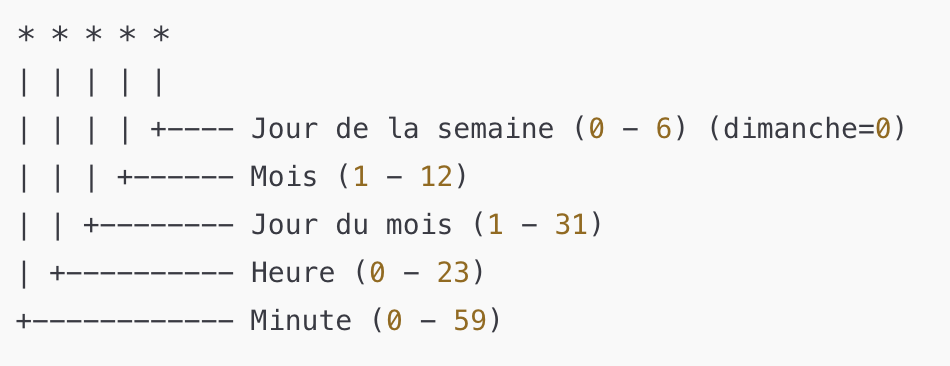

# DaemonSets, Jobs, CronJobs, StatefulSets 
## DaemonSets
### Use Cases for DaemonSet in Kubernetes

| **Category**          | **Objective**                                                                 | **Examples**                                                                                     |
|------------------------|-------------------------------------------------------------------------------|--------------------------------------------------------------------------------------------------|
| **Log Collection & Monitoring** | Deploy agents to collect logs or metrics from each node.                          | - Monitoring tools: Prometheus Node Exporter, Datadog, New Relic<br>- Log collection: Fluentd, Filebeat |
| **Networking & Security** | Configure networking or security tools on all nodes.                                      | - CNI plugins: Calico, Flannel, Weave Net<br>- Proxies: Envoy, Istio<br>- Security tools: Falco, Sysdig |
| **Storage Management** | Ensure storage-related services are running on all nodes.                                   | - Storage managers: Rook, OpenEBS<br>- Disk preparation: Formatting or cleaning local volumes      |
| **System Maintenance** | Execute critical background tasks directly on nodes.                                         | - Node updates: Apply system patches<br>- Time synchronization: NTP services<br>- Config distribution: Scripts or files |
| **Critical Services Deployment** | Deploy services that must run on every node for cluster functionality.                | - Local DNS: CoreDNS, Kube-DNS<br>- Container runtime managers: CRI-O, containerd                  |
| **Targeted Node Subsets** | Run pods only on specific nodes with unique characteristics (via labels or selectors).      | - GPU workloads: Nodes with `nvidia.com/gpu=true`<br>- Fast storage nodes: Labeled as `storage=fast` |

### Deploy on each node
```
ubuntu@cp-node01:~$ kubectl get daemonsets.apps kube-proxy --namespace kube-system 
NAME         DESIRED   CURRENT   READY   UP-TO-DATE   AVAILABLE   NODE SELECTOR            AGE
kube-proxy   3         3         3       3            3           kubernetes.io/os=linux   13d
```
```yaml
apiVersion: apps/v1
kind: DaemonSet
metadata: 
  name: hello-world-ds
spec:
  selector:
    matchLabels:
      app: hello-world-app
  template:
    metadata:
      labels:
        app: hello-world-app
    spec:
      containers:
      - name: hello-world
        image: gcr.io/google-samples/hello-app:1.0
```
Deploy and perform :
```
kubectl get daemonsets -o wide
kubectl get pods -o wide --show-labels
kubectl describe daemonsets.apps hello-world-ds | more
```
Change the label of a pod :
```
MYPOD=$(kubectl get pods --label-columns hello-world-app | awk 'NR == 2 { print $1 }')
kubectl label pods $MYPOD app=bye-world-app --overwrite
kubectl get pods --show-labels 
```
Not a surprise a new pod is created to maintain the desired state.

### Deploy on specific subset of nodes
First label your node
```
kubectl label nodes wk-node02 app-node=hello-world-app
kubectl get nodes --show-labels 
```
Modify yaml to specify nodeSelector
```yaml
  template:
    metadata:
      labels:
        app: hello-world-app
    spec:
      nodeSelector: 
        app-node: hello-world-app
      containers:
      - name: hello-world
        image: gcr.io/google-samples/hello-app:1.0
```
Apply and observe then remove the label
```
kubectl label nodes wk-node02 app-node-
```
Pods are removed from the daemonset.

### Rollout
First take a look on the manifest of our daemon set in k8s
```
kubectl get daemonsets.apps hello-world-ds -o yaml | more
```
It gives a complete yaml with default values
```yaml
apiVersion: apps/v1
kind: DaemonSet
metadata:
  annotations:
    deprecated.daemonset.template.generation: "1"
    kubectl.kubernetes.io/last-applied-configuration: |
      {"apiVersion":"apps/v1","kind":"DaemonSet","metadata":{"annotations":{},"name":"hello-world-ds","namespace":"default"},"spec":{"selector":{"matchLabels":{"app":"hello-world-app"}},"template":{"met
adata":{"labels":{"app":"hello-world-app"}},"spec":{"containers":[{"image":"gcr.io/google-samples/hello-app:1.0","name":"hello-world"}]}}}}
  creationTimestamp: "2024-12-05T08:26:21Z"
  generation: 1
  name: hello-world-ds
  namespace: default
  resourceVersion: "1756872"
  uid: 5c4cd278-e79f-4027-b494-cab84a305d82
spec:
  revisionHistoryLimit: 10
  selector:
    matchLabels:
      app: hello-world-app
  template:
    metadata:
      creationTimestamp: null
      labels:
        app: hello-world-app
    spec:
      containers:
      - image: gcr.io/google-samples/hello-app:1.0
        imagePullPolicy: IfNotPresent
        name: hello-world
        resources: {}
        terminationMessagePath: /dev/termination-log
        terminationMessagePolicy: File
      dnsPolicy: ClusterFirst
      restartPolicy: Always
      schedulerName: default-scheduler
      securityContext: {}
      terminationGracePeriodSeconds: 30
  updateStrategy:
    rollingUpdate:
      maxSurge: 0
      maxUnavailable: 1
    type: RollingUpdate
status:
  currentNumberScheduled: 2
  desiredNumberScheduled: 2
  numberAvailable: 2
  numberMisscheduled: 0
  numberReady: 2
  observedGeneration: 1
  updatedNumberScheduled: 2
```
Update the version of the image, apply and see rollout status
```
kubectl rollout status daemonset hello-world-ds

Waiting for daemon set "hello-world-ds" rollout to finish: 1 out of 2 new pods have been updated...
Waiting for daemon set "hello-world-ds" rollout to finish: 1 out of 2 new pods have been updated...
Waiting for daemon set "hello-world-ds" rollout to finish: 1 of 2 updated pods are available...
daemon set "hello-world-ds" successfully rolled out
```
See new labels
```
ubuntu@cp-node01:~$ kubectl get pods --show-labels 
NAME                   READY   STATUS    RESTARTS   AGE    LABELS
hello-world-ds-57cbm   1/1     Running   0          108s   app=hello-world-app,controller-revision-hash=749f5f6c94,pod-template-generation=2
hello-world-ds-rklfw   1/1     Running   0          106s   app=hello-world-app,controller-revision-hash=749f5f6c94,pod-template-generation=2
```
## Jobs
```yaml
apiVersion: batch/v1
kind: Job
metadata:
  name: hello-world
spec:
  template:
    spec:
      containers:
      - name: ubuntu
        image: ubuntu
        command:
        - "/bin/bash"
        - "-c"
        - "/bin/echo Hello from pod $(hostname) at $(date)"
      restartPolicy: Never
```
### Job Parameters

- **parallelism**: Defines the number of Pods to run simultaneously. By default, Kubernetes runs one Pod at a time. With `parallelism`, you can increase this number to run multiple Pods in parallel.
  
- **completions**: Defines the number of successful executions the Job must complete before it is considered finished.
  
- **backoffLimit**: Specifies how many times Kubernetes will attempt to restart a failed Pod before marking the Job as failed.
  
- **activeDeadlineSeconds**: Limits the total runtime of the Job. If the Job exceeds this time, Kubernetes will terminate it.
  
- **restartPolicy**: Since a Job is a one-time task, the `Never` value is typically used to prevent Pods from restarting, whether the execution is successful or not.

Try backoffLimit with a typo error introduction in command.  
Try completions and parallelism : 
```yaml
apiVersion: batch/v1
kind: Job
metadata:
  name: hello-world
spec:
  completions: 50
  parallelism: 10
  template:
    spec:
      containers:
      - name: ubuntu
        image: ubuntu
...
```

### Explore
Once deploy you can explore the jobs and notice that the pod is terminated. We can look the logs to see the execution message.
## CronJob
```yaml
apiVersion: batch/v1
kind: CronJob
metadata:
  name: my-job-cron
spec:
  schedule: "*/1 * * * *"
  jobTemplate:
...
```
### Cron Expression Syntax



| Cron Expression   | Description                                                           |
|-------------------|-----------------------------------------------------------------------|
| `* * * * *`        | Executes the job every minute.                                        |
| `0 * * * *`        | Executes the job every hour, at minute 0.                             |
| `0 0 * * *`        | Executes the job every day at midnight.                               |
| `0 0 * * 0`        | Executes the job every Sunday at midnight.                            |
| `30 9 * * *`       | Executes the job every day at 9:30 AM.                                |
| `0 9 1 * *`        | Executes the job on the 1st day of each month at 9:00 AM.             |
| `0 0 1 1 *`        | Executes the job on January 1st of each year at midnight.            |
| `*/5 * * * *`      | Executes the job every 5 minutes.                                     |
| `0 12 * * 1-5`     | Executes the job every weekday (Monday to Friday) at 12:00 PM.    

```yaml
apiVersion: batch/v1
kind: CronJob
metadata:
  name: hello-world
spec:
  schedule: "*/1 * * * *"
  jobTemplate:
    spec:
      template:
        spec:
          containers:
          - name: ubuntu
            image: ubuntu
            command:
            - "/bin/bash"
            - "-c"
            - "/bin/echo Hello from pod $(hostname) at $(date)"
          restartPolicy: Never
```
## Difference Between StatefulSet and Deployment

| **Aspect**          | **StatefulSet**                                              | **Deployment**                               |
|----------------------|-------------------------------------------------------------|---------------------------------------------|
| **Pod Identity**     | Each Pod has a unique and stable identifier (e.g., `my-app-0`). | Pods are interchangeable and have no specific identity. |
| **Order**            | Pods are created, updated, and deleted in a strict order.    | No guaranteed order for Pods.               |
| **Storage**          | Each Pod can have its own unique persistent volume.         | Pods generally share a common storage (if required). |
| **Use Case**         | Applications requiring persistent state (e.g., databases, clusters). | Stateless applications with no state requirements (e.g., frontends, APIs). |


