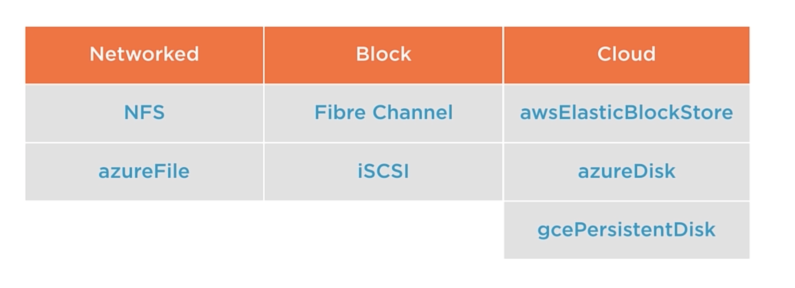

# Storage
## Quick Comparison of Kubernetes Storage APIs

| **API**               | **Usage**                                                                                   | **Examples**                      |
|-----------------------|---------------------------------------------------------------------------------------------|-----------------------------------|
| **PersistentVolume**   | Defines persistent storage at the cluster level.                                           | NFS, iSCSI, AWS EBS              |
| **PersistentVolumeClaim** | Request for persistent storage by an application.                                         | Pods requesting a volume          |
| **StorageClass**       | Defines policies for dynamic provisioning of storage.                                       | AWS gp2, Fast SSD                |
| **Volume**             | Storage directly tied to a Pod (often ephemeral).                                           | emptyDir, configMap, CSI          |
| **VolumeSnapshot**     | Captures a snapshot of a volume for backup or restoration purposes.                         | Backup of a PV                   |
| **CSI**                | Integration with external storage solutions through a standardized plugin interface.        | AWS, Azure, NetApp, Ceph         |

### Summary of Common Issues with Volumes

| **Problem**                        | **Impact**                                                                  | **Solution**                                         |
|------------------------------------|-----------------------------------------------------------------------------|----------------------------------------------------|
| Data loss with `emptyDir`          | Data is lost when the Pod is deleted.                                       | Use PersistentVolumes and PersistentVolumeClaims.  |
| Node dependency with `hostPath`    | Pods are tied to a specific node, reducing portability.                     | Use network storage or cloud-based solutions.      |
| Lack of snapshots or restoration   | Unable to easily back up or restore data.                                   | Opt for CSI-based solutions with VolumeSnapshots.  |
| Limited shared access              | Volume cannot be accessed by multiple Pods simultaneously.                  | Use NFS or `ReadWriteMany` volumes.                |
| Permission issues                  | Risk of access conflicts or authorization errors.                           | Properly configure permissions or use PVCs.        |
| Non-portability between environments | Difficult to migrate between development, staging, and production.          | Use dynamic and portable storage solutions.        |
| Limited size                       | Unable to meet growing storage requirements.                                | Use dynamic storage provisioning with StorageClasses. |

In summary, **Volumes** can be useful for simple or ephemeral cases, but for complex or persistent storage needs, it is better to use **PersistentVolumes** or advanced storage solutions.

Note that we can use NFS with Volume but we will cope with limitations of NFS in Kubernetes

#### **Performance**
NFS can become a bottleneck for applications requiring intensive disk access. Performance may be constrained by the network or the configuration of the NFS server.

#### **Availability**
If the NFS server fails, the Pods using NFS storage will be affected. High availability (HA) mechanisms must be implemented for the NFS server.

#### **Permission Management**
File and directory permissions need to be carefully configured, especially when multiple users or applications access the same storage.

#### **Snapshots and Backups**
NFS does not provide built-in snapshot or restore capabilities. Third-party tools must be configured to handle these features.

#### **Scalability**
NFS may struggle to meet high workloads or scalability demands. For large clusters or critical applications, distributed storage solutions such as **Ceph**, **GlusterFS**, or cloud-based services like **AWS EFS** or **GCP Filestore** are more suitable.

## Persistent Volume
A PersistentVolume (PV) is a piece of storage in Kubernetes that is provisioned either statically or dynamically and can be used by Pods to store data. Unlike regular Volumes, PVs are not tied to the lifecycle of a specific Pod, allowing data to persist even when Pods are deleted or rescheduled. PVs are managed by the Kubernetes cluster and can be backed by different storage systems, such as NFS, AWS EBS, or other cloud storage services.


## PersistentVolumeClaim
A PersistentVolumeClaim (PVC) is a request made by a user or application for storage resources in Kubernetes. It specifies : 
- The amount of storage, 
- Access mode, 
- And other requirements needed.  
Kubernetes will then match the PVC with an available PersistentVolume (PV) that meets the requested criteria. If no suitable PV is available, Kubernetes can provision a new one dynamically (if configured to do so). Essentially, a PVC acts as a way for Pods to claim storage resources without needing to know the details of the underlying storage system. (1 PVC per PV)

## Access mode
- ReadWriteOnce : only one node can mount the volume for RW - aka RWO
- ReadWriteMany : all nodes can mount the volume for RW - aka RWX
- ReadOnlyMany : all nodes can mount the volume for Read only - aka ROX

## Build a NFS Server for test

```
sudo hostnamectl set-hostname nfs-server
```
```
sudo apt install nfs-kernel-server
```
```
sudo mkdir -p /export/volumes
sudo mkdir -p /export/volumes/pod
```
```bash 
sudo bash -c 'echo "/export/volumes *(rw,no_root_squash,no_subtree_check)" > /etc/exports'
```
```
sudo systemctl restart nfs-kernel-server.service
```
On each node declare in /etc/hosts nfs-server and install : 
```
sudo apt install nfs-common
```
Test
```
sudo mount -t nfs4 nfs-server:/export/volumes /mnt/
sudo mount | grep nfs
sudo umount /mnt
```

## Static provisionning
persistentVolumeReclaimPolicy can be Retain, Delete or Recycle (deprecated since 1.25)

```yaml
apiVersion: v1
kind: PersistentVolume
metadata: 
  name: pv-nfs-data
spec:
  accessModes:
  - ReadWriteMany
  capacity:
    storage: 1Gi
  persistentVolumeReclaimPolicy: Retain
  nfs: 
    server: 10.0.0.12
    path: "/export/volumes/pod"
```
```
kubectl apply -f pv-definition.yaml 
kubectl describe  persistentvolume pv-nfs-data 
```

```yaml
apiVersion: v1
kind: PersistentVolumeClaim
metadata: 
  name: pvc-nfs-data
spec:
  accessModes:
  - ReadWriteMany
  resources:
    requests:
      storage: 1Gi
```
```
kubectl apply -f pvc-definition.yaml 
kubectl describe  persistentvolumeclaims pvc-nfs-data 
```
Now we create data on nfs server: 
```
sudo bash -c 'echo "NFS Storage is used clear!" > /export/volumes/pod/data.html'
```
Let's create a deployment :
```yaml
apiVersion: apps/v1
kind: Deployment
metadata:
  name: nginx-pvc
spec:
  replicas: 1
  selector: 
    matchLabels: 
      app: nginx
  template:
    metadata:
      labels:
        app: nginx
    spec:
      volumes:
      - name: webcontent
        persistentVolumeClaim:
          claimName: pvc-nfs-data
      containers:
      - name: nginx
        image: nginx 
        ports:
        - containerPort: 80
        volumeMounts: 
        - name: webcontent
          mountPath: "/usr/share/nginx/html/web-app"
---
apiVersion: v1
kind: Service
metadata:
  creationTimestamp: null
  name: nginx-nfs-svc
spec:
  ports:
  - port: 80
    protocol: TCP
    targetPort: 80
  selector:
    app: nginx
status:
  loadBalancer: {}
    
```
Verify that you can access the data though a curl command on the nginx service
You can scale 
```
kubectl scale deployment nginx-pvc --replicas 4
curl http://10.104.51.13/web-app/data.html
``` 

To delete a pvc, first delete the deployment.  
As pv policy is Retained, data is still stored, note that status is in Released state.  
If we set up a new pvc, it won't be bind to pv unless you perform :
```
kubectl patch persistentvolume pv-nfs-data -p '{"spec": {"claimRef": null}}'
```
Note that if you change persistentVolumePolicy to Delete, NFS will not remove data automatically. Search for other storage system to do that.
## Dynamic provisionning
Example of dynamic provisionning with NFS. It needs installation of a provisioner before starting to use it. Come back to these section once you have study RBAC.
### NFS Provisioner
```yaml
apiVersion: v1
kind: Namespace
metadata:
  name: nfs-provisioner
```
```yaml
apiVersion: v1
kind: ServiceAccount
metadata:
  name: nfs-provisioner
  namespace: nfs-provisioner
---
kind: ClusterRole
apiVersion: rbac.authorization.k8s.io/v1
metadata:
  name: nfs-provisioner-runner
rules:
  - apiGroups: [""]
    resources: ["persistentvolumes"]
    verbs: ["get", "list", "watch", "create", "delete"]
  - apiGroups: [""]
    resources: ["persistentvolumeclaims"]
    verbs: ["get", "list", "watch", "update"]
  - apiGroups: [""]
    resources: ["events"]
    verbs: ["create", "update", "patch"]
  - apiGroups: [""]
    resources: ["nodes"]
    verbs: ["get", "list", "watch"]
  - apiGroups: [""]
    resources: ["pods"]
    verbs: ["get", "list", "watch"]
  - apiGroups: ["storage.k8s.io"]
    resources: ["storageclasses"]
    verbs: ["get", "list", "watch"]
---
kind: ClusterRoleBinding
apiVersion: rbac.authorization.k8s.io/v1
metadata:
  name: run-nfs-provisioner
subjects:
  - kind: ServiceAccount
    name: nfs-provisioner
    namespace: nfs-provisioner
roleRef:
  kind: ClusterRole
  name: nfs-provisioner-runner
  apiGroup: rbac.authorization.k8s.io
```
```yaml
apiVersion: apps/v1
kind: Deployment
metadata:
  name: nfs-provisioner
  namespace: nfs-provisioner
spec:
  replicas: 1
  selector:
    matchLabels:
      app: nfs-provisioner
  template:
    metadata:
      labels:
        app: nfs-provisioner
    spec:
      serviceAccountName: nfs-provisioner
      containers:
        - name: nfs-provisioner
          image: k8s.gcr.io/sig-storage/nfs-subdir-external-provisioner:v4.0.2
          env:
            - name: PROVISIONER_NAME
              value: cluster.local/nfs-provisioner
            - name: NFS_SERVER
              value: "<nfs-server-ip>" 
            - name: NFS_PATH
              value: "/export/nfs"
          volumeMounts:
            - name: nfs-client-root
              mountPath: /persistentvolumes
      volumes:
        - name: nfs-client-root
          nfs:
            server: "<nfs-server-ip>" 
            path: "/export/nfs"
```
### StorageClass
```yaml
apiVersion: storage.k8s.io/v1
kind: StorageClass
metadata:
  name: nfs-storage
provisioner: cluster.local/nfs-provisioner
parameters:
  archiveOnDelete: "false" # Les données ne sont pas archivées à la suppression des PVC
reclaimPolicy: Retain # Garder les données après suppression du PVC
volumeBindingMode: Immediate
```
```yaml
apiVersion: v1
kind: PersistentVolumeClaim
metadata:
  name: nfs-pvc
spec:
  accessModes:
    - ReadWriteMany
  resources:
    requests:
      storage: 5Gi
  storageClassName: nfs-storage
```
```yaml
apiVersion: v1
kind: Pod
metadata:
  name: nfs-test-pod
spec:
  containers:
  - name: test-container
    image: busybox
    command: ["sleep", "3600"]
    volumeMounts:
    - name: nfs-volume
      mountPath: /data
  volumes:
  - name: nfs-volume
    persistentVolumeClaim:
      claimName: nfs-pvc
```